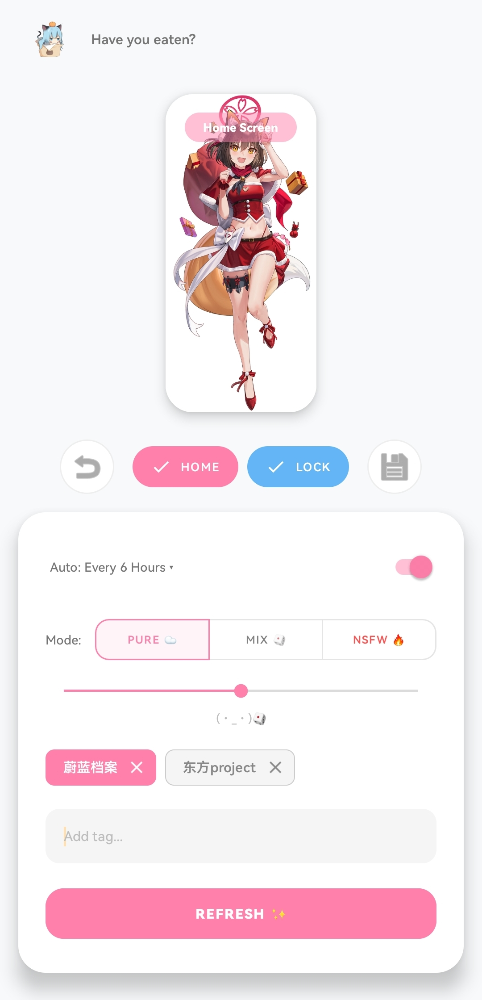
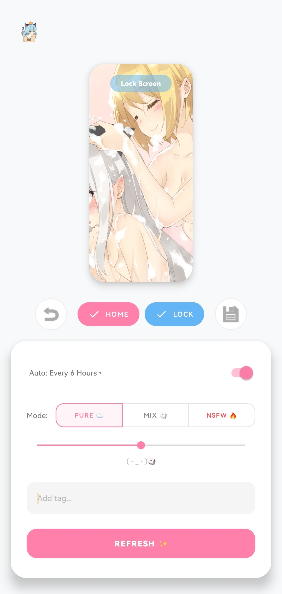
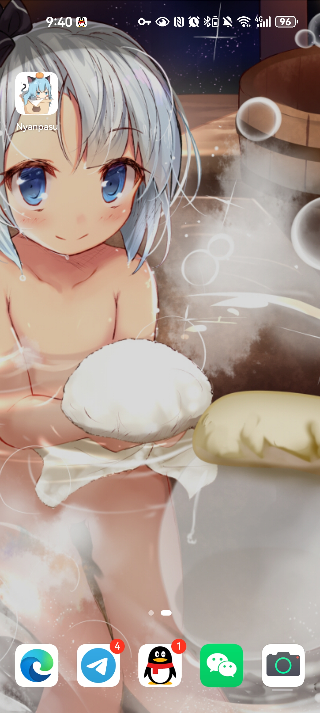
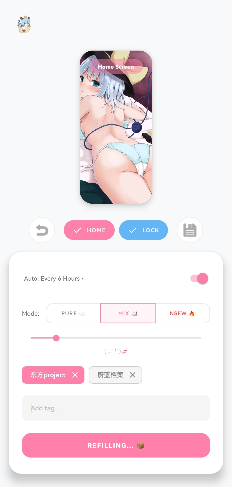

<div align="center">


# Nyanpasu

**每天换一张心动壁纸，主屏锁屏各玩各的。**

*Your kawaii wallpaper companion — dual-screen, zero ads, pure local.*

<br/>

[](https://github.com/FranklinNexus/Nyanpasu/releases)
[](LICENSE)
[](https://github.com/FranklinNexus/Nyanpasu/releases)
[](#-开发者)

<br/>

### 👉 [立即下载 APK](https://github.com/FranklinNexus/Nyanpasu/releases/latest) 👈

*免费 · 无广告 · 无追踪 · 开源*

</div>

---

## 为什么 thousands 的人需要一个「会换壁纸的 App」？

系统自带壁纸太无聊，相册里翻来翻去又麻烦。  
**Nyanpasu** 帮你自动发现高质量 ACG 壁纸，一键换上手机——还能让**主屏和锁屏各用各的风格**。

> 早上 7 点自动换一张新的，解锁手机那一刻，心情就变了。

---

## ✨ 三大理由，现在就装

| | 功能 | 你会感受到 |
|---|---|---|
| 🌸 | **双流引擎** | 主屏老婆、锁屏风景？粉灯同步、蓝灯独立，三档开关随你玩 |
| ⚡ | **秒开体验** | 双缓冲预取，点 Refresh 常常 **Instant Load**，不用干等 |
| 🖼️ | **所见即所得** | 双指缩放、拖动构图，预览框里什么样，壁纸就什么样 |

---

## 📸 看一眼就知道

<div align="center">
  
  
  
  
</div>

---

## 🎯 还能做什么？

- **智能 Tag** — `Strict 🔒` 锁定本命角色，`Soft 🎲` 随机惊喜；原神、BA、碧蓝、Fate、东方…… mascot 还会接梗
- **口味三档** — Pure ☁️ / Mix 🎲 / NSFW 🔥，一条滑杆微调萌度
- **自动换壁纸** — 每日 7:00，或每 6 / 12 / 24 小时，后台静默更新
- **撤销 & 导出** — 5 张历史一键 Undo；喜欢就 Save 到相册
- **萌系 mascot** — 会打招呼、会吐槽、会 react 你的 Tag（连点 Logo 10 次有彩蛋 🎉）
- **国产机友好** — 小米 / 华为 / OPPO / vivo 等 OEM 壁纸写入专项适配

---

## 🛡️ 我们不做的事

- ❌ 广告  
- ❌ 用户追踪 / 行为分析  
- ❌ 云端上传你的壁纸  
- ❌ 臃肿权限  

壁纸文件**只存在你的手机里**。详见 [隐私政策](PRIVACY_POLICY.md)。

---

## 📥 安装

1. 打开 **[Releases 页面](https://github.com/FranklinNexus/Nyanpasu/releases/latest)**
2. 下载 `app-release.apk`（或最新构建）
3. 允许「安装未知应用」→ 安装 → 完成

> **系统要求：** Android 7.0（API 24）及以上  
> **建议：** 授予更换壁纸权限；华为等机型请关闭「杂志锁屏」以获得最佳体验

---

## 🚀 30 秒上手

1. 打开 App，等 mascot 说 **Nyanpasu~ 👋**
2. 点 **Home / Lock** 按钮切换模式（关 → 粉同步 → 蓝独立）
3. 拖 **Style** 滑杆调口味，可加 Tag 定制搜索
4. 点 **Refresh ✨** — 构图满意后，壁纸已上好
5. 打开 **Auto-Update**，让手机每天自己变好看

---

## ⭐ 喜欢就 Star

如果 Nyanpasu 让你的锁屏好看了哪怕一点点，  
欢迎在 GitHub 点一颗 **Star** —— 这是独立开发者最好的动力。

<div align="center">

[](https://github.com/FranklinNexus/Nyanpasu)

</div>

---

## 🛠 开发者

纯 Kotlin · Coroutines · WorkManager · Coil · Material 3

```bash
git clone https://github.com/FranklinNexus/Nyanpasu.git
cd Nyanpasu
./gradlew assembleDebug
```

欢迎 PR 与 Issue，详见 [CONTRIBUTING.md](CONTRIBUTING.md)。

---

## 📬 联系

- **作者：** [KuroshiMira](https://WisdomEchoes.net)
- **Telegram：** [@FranklinNexus](https://t.me/FranklinNexus)
- **更新日志：** [CHANGELOG.md](CHANGELOG.md)

---

<div align="center">

**Nyanpasu~ (〃＾▽＾〃) 👋**

*Made with ❤ for otaku who care about their lock screen.*

</div>
